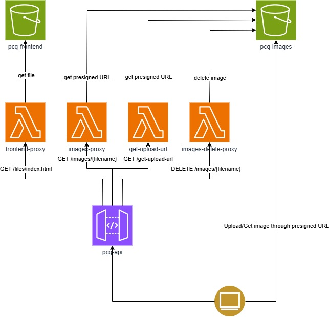

# pcg-webapp

Available at: https://qjfawu1lfh.execute-api.eu-north-1.amazonaws.com/pcg/files/index.html

## 📷 Image Upload Web Application

This is a lightweight web application hosted on AWS that allows users to upload, view, and delete images. The application uses a serverless architecture with AWS S3, Lambda, and API Gateway to securely manage image files and restrict access based on IP addresses.

## 🏗️ Architecture Overview

The application consists of the following components:

- **Image Storage**:  
  Uploaded images are stored in a private S3 bucket named `pcg-images`.

- **Frontend Hosting**:  
  A static HTML file, served as the frontend, is stored in another private S3 bucket named `pcg-frontend`.

- **Access Control**:  
  Both S3 buckets are set to private, meaning they are not directly accessible by clients. All access to these resources is mediated through AWS Lambda functions and presigned URLs.

- **Lambda Functions and Endpoints**:

      - `GET /get-upload-url`:  

  Handled by the `get-upload-url` Lambda, this generates a presigned S3 URL that allows the client to upload an image directly to the `pcg-images` bucket.

      - `GET /images/{filename}`:  

  Handled by the `images-proxy` Lambda, this retrieves all uploaded filenames.

      - `GET /images/{filename}`:  

  Handled by the `images-proxy` Lambda, this retrieves a presigned URL for an image so the client can view it.

      - `DELETE /images/{filename}`:  

  Handled by the `images-delete-proxy` Lambda, this deletes a specified image from the `pcg-images` bucket.

      - `GET /files`:  

  Handled by the `frontend-proxy` Lambda, this fetches the HTML file from `pcg-frontend` and returns it to the client.

- **Presigned URL Workflow**:  
  Clients never access the S3 buckets directly. Instead, they receive presigned URLs from Lambda functions, enabling secure direct uploads and downloads to and from S3.

- **API Gateway**:  

  - All client requests pass through an API Gateway, which:

  - Routes requests to the appropriate Lambda functions.

  - Restricts access to whitelisted IP addresses only, enhancing security.

  - Ensures all communication with AWS resources follows the correct flow through trusted entry points.

  - This setup ensures that all file operations are controlled, secure, and auditable, without exposing the underlying storage directly to users.
